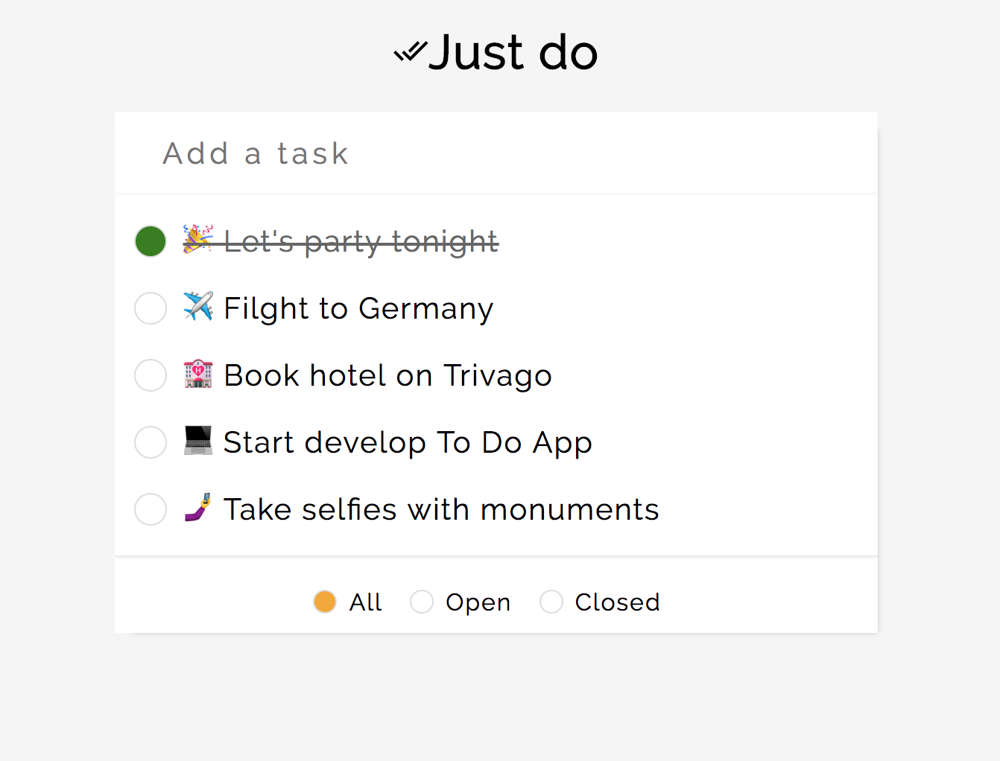

### Simple Todo App [](https://travis-ci.org/ayusharma/todo)

* * *


A simple todo app made using 
[Incremental DOM](http://google.github.io/incremental-dom/#about ) and 
[Redux](redux.js.org).

Link : http://ayusharma.in/todo/dist/

## Requirements

Please make sure that you have Node.js and npm installed on your system. This
application is built with webpack, and without those two tools, you can't proceed.

- Node.js (recommended: 4.x)
- npm (recommended: 2.x or 3.x)

## Installation
```sh
    npm install
```

## Running Tests
```sh
    npm run test
```
Repo includes test cases for Redux's reducers with Jest.

## Webpack dev server
It will start webpack dev server with Hot module replacement.
```sh
    npm run dev
```
Visit `http://localhost:8080/webpack-dev-server/index.html` in your browser to 
check application.

## Build
It will create minified build in project's dist directory.
```sh
    npm run build
```

## First Impression & Challenges
* * *
I found tasks quite interesting as I have to make end to end solution here. 
I found dependencies little bit outdated (Webpack 1.x,  Babel 6.x etc) but It 
can be the constraint of the task to implement things in the current setup. So I
kept the dependencies in provided versions. I also noticed all the dependencies 
in production state. So over the time I managed `dependencies` and 
`devDependencies` in `package.json`

## Tasks
* * *
#### WEB-101: Support enter key for add todo field
I converted the input field to inside `form` tag. It gave me functionality 
submit `form` on `enter` key press. In later commits, I added `return false` on `onsubmit` and
make a check to not to submit blank value in redux store.

Commits:
- 3f33f62 WEB-101: Support enter key for add todo field
- f9990b1 Fix: Stop user to submit blank value in list

#### WEB-102: Adding a new todo causes text field focus to be lost
I added `focus` property to `add todo` click listener. It is keep focusing on
input element.

Commits:
- 31029b7 WEB-102: Adding a new todo causes text field focus to be lost

#### WEB-103: Add status filtering test
On initial inspection, I identified `Redux` implementation. I did following:
- tests using `jest`
- `combineReducer` to combine `todo` and `filter` reducers.
- action and listener for setFilter.
- todo filtering for view according to filter.
- filter template for `#filter` and conditional template.

Commits:
- 5848dea WEB-103: Add status filtering test

#### WEB-120: Save users todo items
Added `localstorage` in `subscribe` and `createStore`. Later in redux 
implementation task, I added this by using `applyMiddleware`

Commits:
- cfb0c5e WEB-120: Save users todo items

#### WEB-201: Extract CSS into separate file
I used `extract-text-webpack-plugin` in webpack and handled `production` and 
`development` scenario.
- environments from package.json

Commits:
- 0e6eb63 WEB-201: Extract CSS into separate file

#### WEB-303: Improve developer experience
Added `webpack-dev-server` with `webpack-html-plugin` to provide HMR.

Commits:
- cba71f0 WEB-303: Improve developer experience

#### WEB-202: Optimized bundle generation
First of all I thought about `webpack-bundle-analyser` to inspect bundles. After
that I have added following things:
- `webpack.optimize.AggressiveMergingPlugin`
- `webpack.optimize.CommonsChunkPlugin`
- `webpack.DefinePlugin`
- `webpack.optimize.UglifyJsPlugin`
- devtool support - map files only in development mode.

Also added a commit later.

Commits:
- f4a26f1 WEB-202: Optimized bundle generation
- 8a2bcc6 RE:WEB-202: Optimized bundle generation

Reference https://webpack.github.io/docs/list-of-plugins.html

#### WEB-203: Replace lib/state.js
Implemented `redux` using `createStore` and `applyMiddleware` for localstorage.

Commit:
- 434a2c1 WEB-203: Replace lib/state.js

#### WEB-110: Improve visual appearance && WEB-104: Change filter position test
Improved the visual experience, added scss, and implemented 
`index.html#filter#renderBottom#filterTop.` Later on, when things stared to work,
I improved the UI again.

Commits:
- 39ee90b WEB-110, WEB-104: Improve visual appearance, Change filter position test
- 82bbc63 Improvement:WEB-110: Improve visual appearance
- ebe0342 UI improvement - card layout
- a0300d7 No tasks handler and UI fixes

#### WEB-302: Static feature compilation
I developed a find and replace loader for this. It is in `loader` directory.

Commit:
- 91944cb WEB-302: Static feature compilation

#### WEB-301: Optimize the view rendering
For this I implemented rendering and markeup in 'incremental-dom'. I also tried
some JSX libraries but could not implemented due to bugs.Some options I found on
internet:
- https://github.com/jridgewell/babel-plugin-transform-incremental-dom
  - It occured to me. Input conditional check fails - https://github.com/jridgewell/babel-plugin-transform-incremental-dom/issues/53
  - Unable to render nested JSX.
  
- https://github.com/OpenJSX/jsx-to-idom (Not compatible with Babel 6)

I found these very useful:
- Incremental DOM Docs
- https://www.ericponto.com/blog/2015/07/18/render-html-strings-via-incremental-dom/
- https://github.com/tehsis/incremental-todo
- https://github.com/auth0/charata 

So in the end I wrote the markup using `incremental-dom`.


#### Other things:
 - Jest Fixup and setup a782097
 - Remove to do feature to show remove button on hover 42ce173